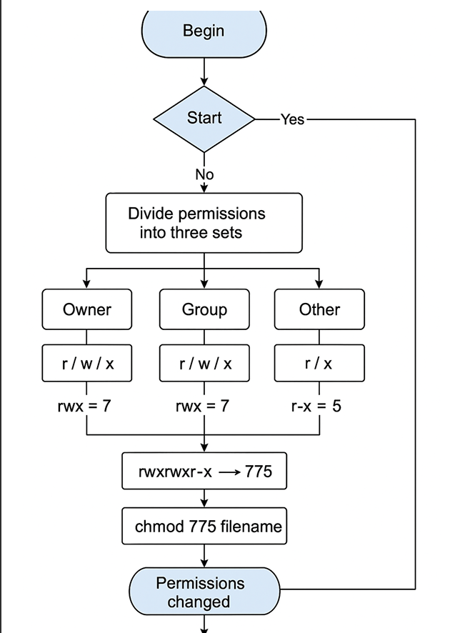
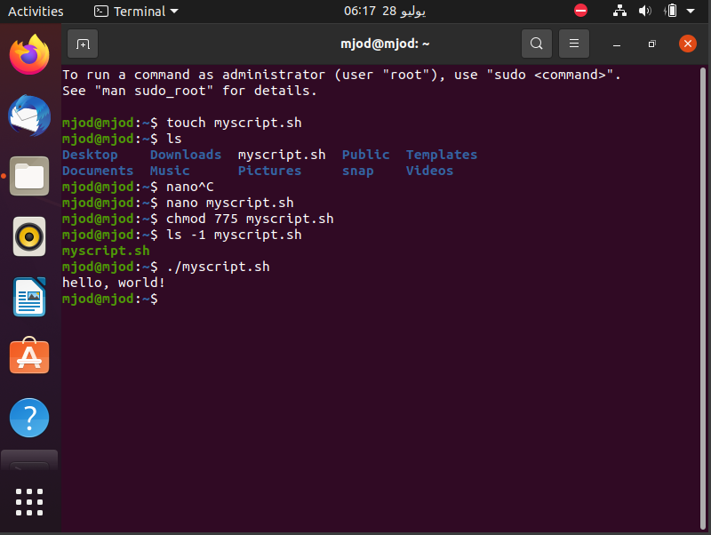

#  Bash Script Automation Task

This project demonstrates a simple shell script written and executed in a Linux environment (Ubuntu).  
The purpose is to create a bash script file that prints "Hello, world!" and run it from the terminal.

##  Flowchart

The following flowchart describes the overall process:



##  Script Code

```bash
#!/bin/bash
echo "hello, world!"
```

##  Terminal Output

The following screenshot shows the execution of the shell script:



---


